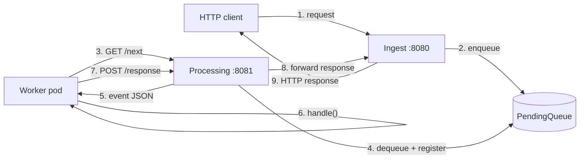

# openl4d

An **AWS-Lambda-style HTTP runtime** for Kubernetes, written in Go.

`openl4d` — pronounced **"open L for D"**, a phonetic play on *"open lambda"* —
accepts HTTP requests, turns each one into a Lambda-shaped event, and hands it
to a pool of pull-based worker pods over the same
`/runtime/invocation/next` long-polling contract that the AWS Lambda Runtime
API exposes to its custom runtimes.

> **Status: POC / investigation project.** Not production ready. No auth, no
> persistence, no K8s manifests yet — the queue is in-memory and the manager
> is a single process. The point of the repo is to explore the design and
> validate the runtime contract end-to-end. See
> [doc/roadmap.md](./doc/roadmap.md) for what would change to take this past
> the POC.

## Why

There is a recurring pattern in serverless platforms where the platform also
owns the *scheduler*: it builds your code, decides which node it lands on,
scales it, and routes traffic to it. Kubernetes already does all of that.

`openl4d` is a deliberate experiment in **delegating everything Kubernetes
already does**:

- **Function deployment?** Manual `Deployment` of your worker image.
- **Autoscaling?** [KEDA](https://keda.sh/) on a queue-depth metric the
  manager exports to Prometheus.
- **Networking, secrets, RBAC?** Whatever your cluster already provides.

What is left is small enough to fit in a few hundred lines: an HTTP server
that turns a request into an event, a queue, and an HTTP server that hands
events to whichever worker asks for one.

This is contrasted with the
[CMU OpenLambda paper](https://www.usenix.org/conference/hotcloud16/workshop-program/presentation/hendrickson),
which rebuilds the scheduling layer too — the `openl4d` thesis is that you
should not.

## How it works



Two HTTP servers run inside the same process:

- **Ingest (`:8080`)** — what external clients call.
- **Processing (`:8081`)** — what worker pods call, speaking the
  [AWS Lambda Runtime API](./doc/runtime-api.yaml) contract.

A buffered Go channel (`PendingQueue`) plus a `sync.RWMutex`-guarded map
(`ProcessingMap`, keyed by request ID) bridge the two.

The full breakdown is in [doc/architecture.md](./doc/architecture.md). Sequence
diagrams for the happy path, error path, timeout, and shutdown live in
[doc/request-lifecycle.md](./doc/request-lifecycle.md).

## Quick start

```bash
# 1. Run the manager (two servers, one process)
go run . serve

# 2. Build and run a worker (in another shell)
docker build -t openl4d-dummy-runtime ./docker/dummy-runtime
docker run --rm \
  -e PROCESS_BASE_URL=http://host.docker.internal:8081 \
  -e RESPONSE_QUERY_KEY=echo \
  openl4d-dummy-runtime

# 3. Send a request (in a third shell)
curl "http://localhost:8080/open-l4d?echo=abc123"
# → {"ok":true,"requestId":"…","path":"/open-l4d","echo":"abc123"}
```

To run multiple workers and load-test with k6:

```bash
docker compose up --build --scale runtime=3
k6 run scripts/k6-echo.js
```

The full walkthrough, including how to manually step through the runtime
protocol with `process.http`, is in [doc/local-testing.md](./doc/local-testing.md).

## Project layout

```
.
├── cmd/                   # cobra entrypoint + serve command
├── internal/
│   ├── function/          # Invocation, PendingQueue, ProcessingMap, event shapes
│   └── server/
│       ├── ingest/        # :8080 — request → event, blocks on ResponseChan
│       └── processing/    # :8081 — /next, /response, /error controllers
├── docker/
│   └── dummy-runtime/     # reference worker (native Go, no sleeps)
├── scripts/k6-echo.js     # load test
├── doc/                   # long-form documentation (start here for diagrams)
├── compose.yaml           # local manager + N workers
└── main.go
```

## Documentation

The [`doc/`](./doc) folder has the deep dives. If you only read one page, read
[doc/architecture.md](./doc/architecture.md).

- [Architecture](./doc/architecture.md)
- [Request lifecycle (sequence diagrams)](./doc/request-lifecycle.md)
- [Runtime protocol (wire-level contract)](./doc/runtime-protocol.md)
- [State & data structures](./doc/state-and-data-structures.md)
- [Local testing & load testing](./doc/local-testing.md)
- [Dummy runtime worker reference](./doc/dummy-runtime.md)
- [Roadmap](./doc/roadmap.md)

## License

MIT — see [LICENSE](./LICENSE).
