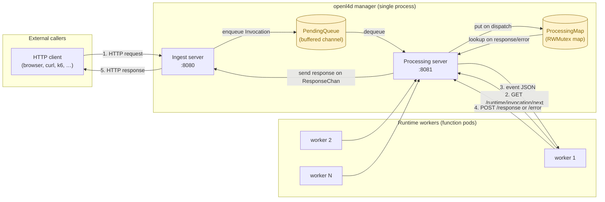

# Architecture

`openl4d` is split into two HTTP servers that share two in-memory data structures
inside the same process. Worker pods (runtimes) connect to one of those servers
over HTTP to pull events and post responses, mirroring the
[AWS Lambda Runtime API](./runtime-api.yaml) contract.

## High-level diagram



## Components

### Ingest server (`internal/server/ingest`)

Listens on `:8080` and accepts any HTTP method/path. Each incoming request is:

1. Converted to an AWS-Lambda-style `HttpRequestEvent` (see
   [runtime-protocol.md](./runtime-protocol.md)).
2. Wrapped in an `Invocation` with a 30-second deadline and a buffered
   `ResponseChan` of capacity 1.
3. Enqueued into the shared `PendingQueue`.
4. Held on the goroutine that is serving the HTTP request, blocking on
   `ResponseChan` until a worker finishes or the deadline expires.

### Processing server (`internal/server/processing`)

Listens on `:8081` and exposes the runtime API the worker pods talk to:

| Route                                                  | Verb | Purpose                                    |
| ------------------------------------------------------ | ---- | ------------------------------------------ |
| `/2018-06-01/runtime/invocation/next`                  | GET  | Long-polled dequeue, returns the event.     |
| `/runtime/invocation/{request_id}/response`            | POST | Success path: worker returns a response.    |
| `/runtime/invocation/{request_id}/error`               | POST | Failure path: worker reports an error.      |

When `next` returns an event, the corresponding `Invocation` is moved from the
queue into the `ProcessingMap`, keyed by `RequestID`. The map is the bridge
between the worker's POST and the ingest goroutine that is still waiting on
`ResponseChan`.

### Shared state

- `PendingQueue` — a buffered channel of `*Invocation` plus a `closed` signal
  channel. Open during normal operation, drained on shutdown.
- `ProcessingMap` — a `sync.RWMutex`-guarded `map[string]*Invocation` indexed by
  request ID. Entries live only while a worker is processing the event.

See [state-and-data-structures.md](./state-and-data-structures.md) for the full
state machine and concurrency semantics.

## Why two servers?

Splitting ingest (`:8080`) and processing (`:8081`) keeps the public traffic
plane and the worker control plane independent:

- The ingest port is the one that an external HTTP load balancer / Ingress
  would expose. It is the only port a caller ever needs to know about.
- The processing port is consumed exclusively by worker pods inside the
  cluster. It can be locked down by a `NetworkPolicy` and never exposed.
- The two ports can be put behind different authentication policies and
  scraped independently for metrics.

## Why workers pull instead of the manager pushing?

This is the same trade-off AWS Lambda makes with its Runtime API: a pull model
removes the need for the control plane to know where every worker is, how many
are healthy, or how busy each one is. A worker simply asks for work whenever it
is idle. That naturally:

- Load-balances based on real worker capacity.
- Survives worker restarts without reassignment logic.
- Fits cleanly with K8s primitives: workers are stateless pods; scale them with
  a Deployment + HPA / [KEDA](./roadmap.md) and they just start polling.

## Runtime workers

Workers are any HTTP client that speaks the runtime protocol. The reference
implementation is the [dummy runtime](./dummy-runtime.md) in
`docker/dummy-runtime/`. A worker's loop is:

```text
forever:
    event = GET .../runtime/invocation/next
    response = handle(event)
    POST .../runtime/invocation/{event.requestId}/response  (or /error)
```

Workers are deployed and scaled independently of the manager. The manager does
not start or stop them; that responsibility is delegated to Kubernetes (see
[roadmap.md](./roadmap.md) for the KEDA autoscaling plan).

## Related docs

- [Request lifecycle](./request-lifecycle.md) — end-to-end sequence diagram.
- [Runtime protocol](./runtime-protocol.md) — HTTP contract details.
- [State & data structures](./state-and-data-structures.md) — queue, map,
  cancellation, drain semantics.
- [Local testing](./local-testing.md) — how to run it on your machine.
- [Roadmap](./roadmap.md) — where the POC goes next.
