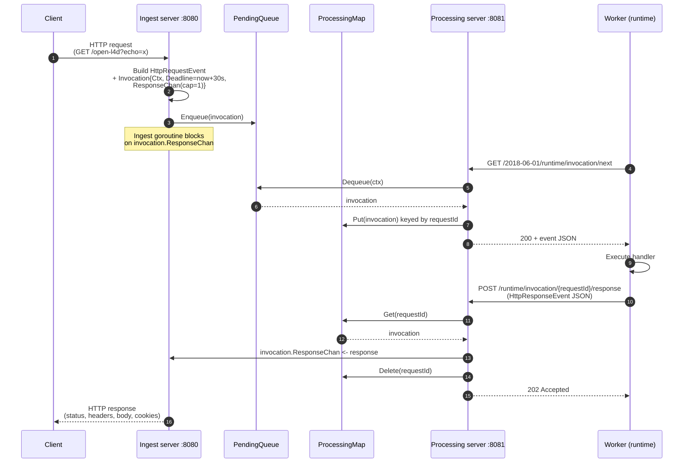
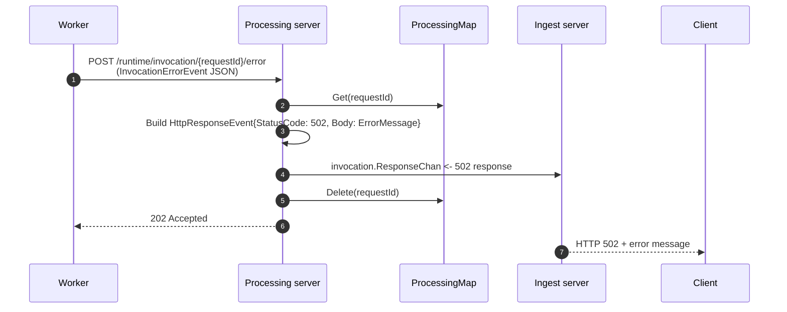
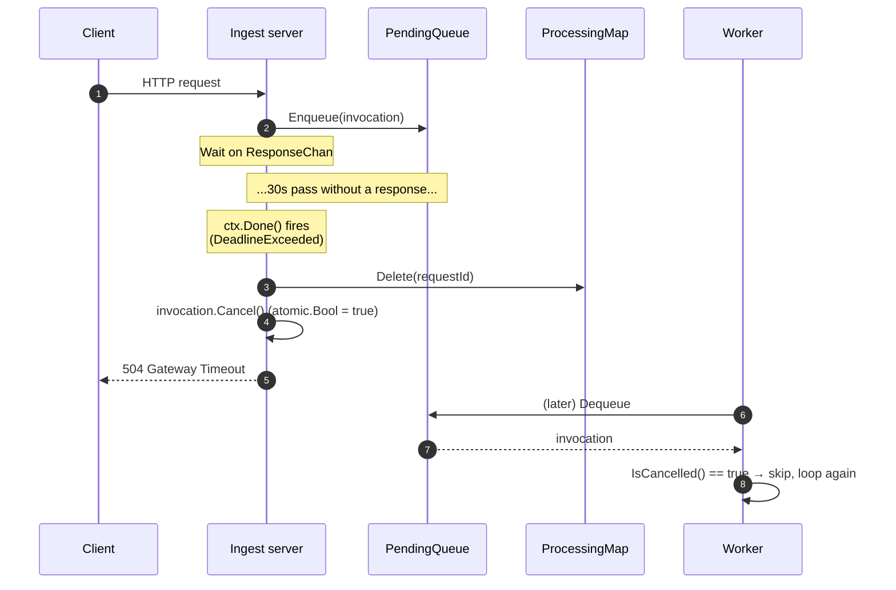

# Request lifecycle

This page walks one request from the moment a client calls the ingest port to
the moment they receive a response (or an error). For the data structures
referenced here, see [state-and-data-structures.md](./state-and-data-structures.md).

## Happy path

## Function-error path

If the handler fails, the worker POSTs to `…/error` instead of `…/response`.
The processing server turns the error into an `HttpResponseEvent` with status
`502 Bad Gateway` and pushes it down the same `ResponseChan`:

## Timeout path (worker is too slow or never picks up the event)

Every invocation carries a 30-second deadline. If `Ctx.Done()` fires before the
worker sends a response, the ingest goroutine wakes up first and returns an
error to the client. The invocation is marked cancelled so any worker that
later dequeues it will skip it.

The same flow runs if the client disconnects early — `ctx.Err()` is then
`context.Canceled`, and the response to the (already-gone) client is `499`.

## Late or duplicate responses

A worker may POST a response after the deadline has already triggered ingest
cleanup. In that case the request is no longer in `ProcessingMap`:

| Situation                                  | Response code from `/response` or `/error` |
| ------------------------------------------ | ------------------------------------------ |
| Request ID not found in map                | `404 Not Found`                            |
| Found but `Ctx` already done / cancelled   | `410 Gone`                                 |
| Found and successfully forwarded           | `202 Accepted`                             |
| Worker POSTs while client disconnected     | `499 Client Gone`                          |

Both `/response` and `/error` decode JSON with `DisallowUnknownFields`, so
unexpected payload keys are rejected with `400 Bad Request`.

## Shutdown / drain path

On `SIGINT` / `SIGTERM` the manager:

1. Closes the `PendingQueue` so no new requests are accepted (subsequent
   `Enqueue` returns `ErrQueueClosed` → ingest replies `503`).
2. Shuts down the ingest server with a 5-second grace period.
3. Drains in-flight work for up to 30 seconds: waits until both the queue and
   the processing map are empty (or the deadline hits).
4. Shuts down the processing server with a 5-second grace period.

A worker that calls `next` while the queue is drained gets a `204 No Content`
response (`ErrQueueDrained`).

See `cmd/serve.go` for the actual orchestration.
