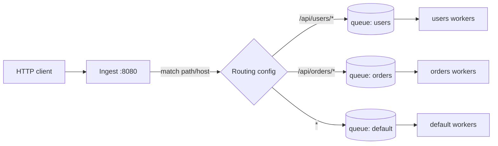
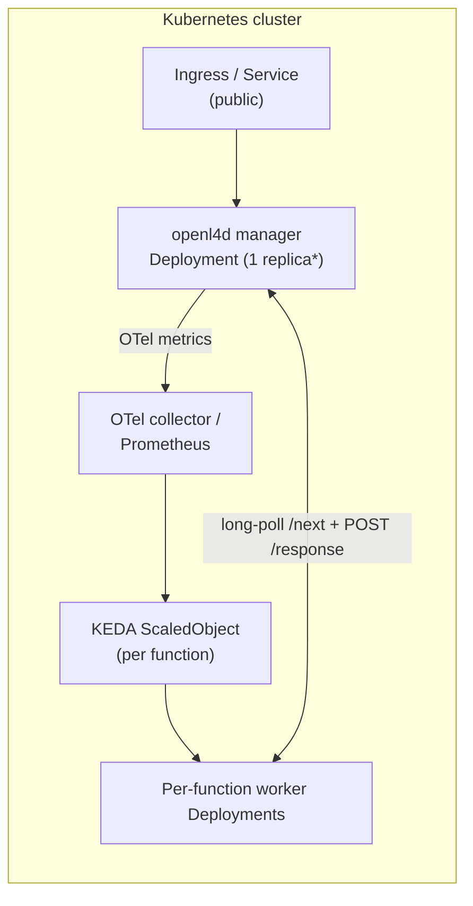

# Roadmap

`openl4d` is a personal investigation project. The POC in this repo proves that
the runtime-API model works end-to-end with one process plus arbitrarily many
Docker workers. Everything below is what would have to change to take it
beyond a curiosity.

These are notes, not commitments.

## Next up

The two features below are the planned next milestones, in order. Everything
under [Later](#later) is intentionally fuzzier and waits behind these.

### 1. Lambda function routing

Today every HTTP request lands in one shared `PendingQueue` and any worker can
pick up any event — there is effectively one function for the whole manager.
The next step is to support **multiple named functions** with a configurable
routing table that maps incoming requests to a function:

Shape of the work:

- A config (file or flag) declaring routing rules with **wildcard** support
  (e.g. `/api/users/*`, `*.users.example.com`, `/health` exact match).
- One `PendingQueue` + `ProcessingMap` per function, plus a deterministic
  match-order so overlapping rules behave predictably.
- The processing-server `GET /next` learns *which* function the calling
  worker belongs to — likely a path segment
  (`/2018-06-01/runtime/invocation/next?function=users`) or a header — so it
  only hands out events from the matching queue.
- Per-function metrics in anticipation of step 2.

This is the smallest change that lets one `openl4d` instance host more than
one function, which is what unlocks the autoscaling work below.

### 2. OpenTelemetry metrics → KEDA autoscaling

Once functions are first-class, the manager exports an
[OpenTelemetry](https://opentelemetry.io/) metrics pipeline (OTLP / Prometheus
exporter) so a [KEDA](https://keda.sh/) `ScaledObject` can scale each
function's worker `Deployment` independently. Initial metric set
(all labelled `function="<name>"`):

- `openl4d_pending_queue_depth`
- `openl4d_in_flight`
- `openl4d_oldest_pending_age_seconds`
- `openl4d_invocation_duration_seconds` (histogram)
- `openl4d_invocation_outcomes_total{outcome=ok|error|timeout|client_gone}`

Autoscaling signal is queue depth (and/or oldest-pending-age) per function,
so each function pool scales on its own backlog.

## Other near-term polish

- **Tunable flags.** Lift the hard-coded constants
  (queue capacity, deadline, body cap, ports) into CLI flags or env vars.
  See the table in [state-and-data-structures.md](./state-and-data-structures.md).
- **Lambda-Runtime-* response headers.** Emit `Lambda-Runtime-Aws-Request-Id`
  and `Lambda-Runtime-Deadline-Ms` from `GET …/next` so existing custom
  runtime clients can pick up request metadata without parsing the event body.
- **Versioned response/error paths.** Move `/runtime/invocation/{id}/response`
  and `/runtime/invocation/{id}/error` under the `/2018-06-01` prefix to match
  the AWS spec exactly.
- **Per-request handler logs.** Today logs are at the process level — adding
  the request ID to every log line on the ingest and processing sides makes
  correlating client and worker logs trivial.

## Kubernetes integration

The architecture is designed around K8s primitives — see
[architecture.md](./architecture.md). To actually run there:

\* The manager is currently single-process / in-memory. Multiple replicas
require either a shared queue (Redis, NATS, …) or a sticky-routing layer.
Investigating which way to go is part of the work.

What needs to exist:

- Helm chart (or kustomize base) with:
  - `Deployment` for the manager.
  - `Service` exposing `:8080` (ingest) cluster-internally + an `Ingress`.
  - `Service` exposing `:8081` (processing) cluster-internally with a
    `NetworkPolicy` restricting access to the worker pods.
  - One `Deployment` per function for workers, each with the worker image and
    a `PROCESS_BASE_URL` (+ function name) pointing at the processing
    Service.
- The OTel metrics pipeline described under
  [Next up → 2. OpenTelemetry metrics → KEDA autoscaling](#2-opentelemetry-metrics--keda-autoscaling).
- KEDA `ScaledObject` per function, driven by
  `openl4d_pending_queue_depth{function="…"}`.
- A health endpoint (`/healthz`, `/readyz`) on each server.

## Later

These are the bigger open questions and intentionally fuzzy:

- **Manager HA.** A single manager replica is fine for an experiment but is a
  SPOF for anything real. Options on the table:
  - Externalize the queue (NATS JetStream, Redis Streams, …) and let multiple
    manager replicas share it.
  - Keep in-memory queue, run multiple managers, and use a consistent-hash
    router up front (heavier, more failure modes).
- **Worker isolation.** The dummy runtime is a Docker container per worker. A
  next step is microVMs (Firecracker / Kata) for stronger isolation and
  better cold-start economics.
- **Cold starts.** Currently workers are always-on. A "scale to zero" mode
  with KEDA + activator would close the gap with hosted Lambda, at the cost
  of needing a request-buffering layer in front of the manager.
- **Streaming responses.** AWS supports streaming Lambda responses
  (`application/vnd.amazon.lambda.response+json` with chunked transfer
  encoding). Adding it is mostly a refactor of `writeResponse` + a worker
  protocol change.

## Non-goals (for now)

The original [OpenLambda paper](https://www.usenix.org/conference/hotcloud16/workshop-program/presentation/hendrickson)
took a "build the platform from scratch" approach. `openl4d` consciously
**does not**:

- Build its own scheduler — that's Kubernetes' job.
- Build its own image builder / deployer — users deploy their own worker
  Deployments containing whatever code they want.
- Try to be a drop-in replacement for AWS Lambda's full surface (Layers,
  Insights, X-Ray, Cognito events, …).

Keeping that list short is the point of the project.
