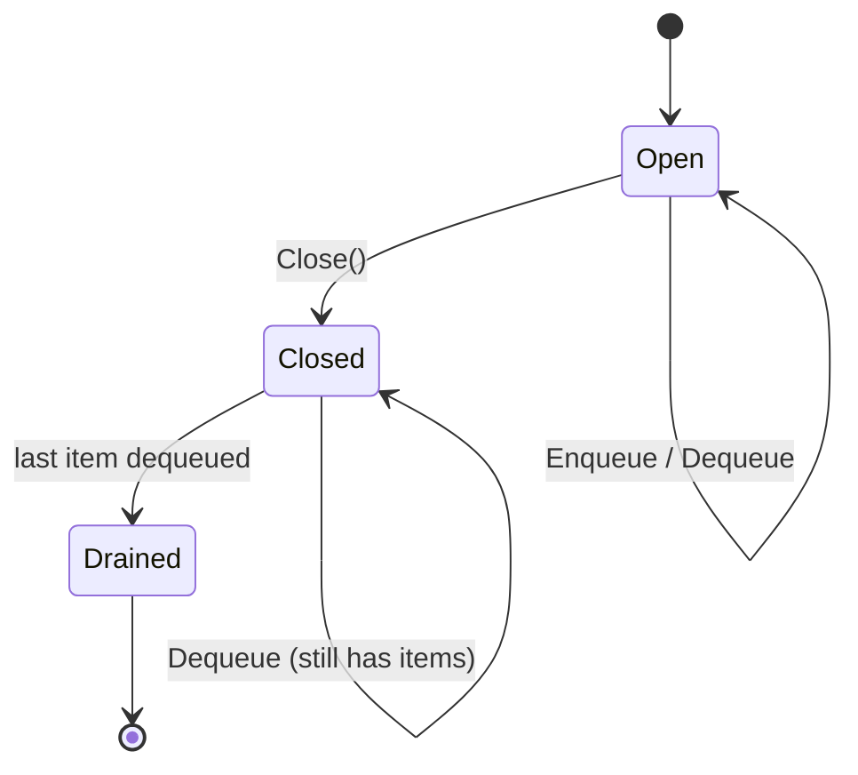

# State & data structures

Everything `openl4d` cares about lives in two in-process Go data structures
plus a per-request `Invocation` value. This page explains how they fit
together, what the lifetimes look like, and where concurrency is enforced.

## Invocation

`internal/function/invocation.go`

```go
type Invocation struct {
    Event        HttpRequestEvent
    ResponseChan chan *HttpResponseEvent // capacity 1
    Ctx          context.Context        // deadline = now + 30s
    Deadline     time.Time
    cancelled    atomic.Bool
}
```

One `Invocation` is created per inbound HTTP request and lives until either:

- the ingest goroutine reads from `ResponseChan` and writes back to the client,
  or
- `Ctx.Done()` fires (deadline or client cancellation) and the ingest goroutine
  gives up.

`ResponseChan` has capacity `1`, so the processing server can push the
response without blocking even if the ingest goroutine is mid-write.

`Cancel()` flips an atomic bool that workers honour the next time they pick the
invocation up from the queue — see the dequeue loop below.

## PendingQueue

`internal/function/pendingqueue.go`

```go
type PendingQueue struct {
    ch        chan *Invocation
    closed    chan struct{}
    closeOnce sync.Once
}
```

A buffered channel (capacity is configurable at construction; the binary
currently passes `4`) with a separate `closed` signal channel.

State machine:



| State    | `Enqueue`                | `Dequeue`                                  |
| -------- | ------------------------ | ------------------------------------------ |
| Open     | sends to channel, blocks if full until ctx fires | reads from channel, blocks until item or ctx fires |
| Closed   | returns `ErrQueueClosed`  | reads remaining items, then returns `ErrQueueDrained` |
| Drained  | returns `ErrQueueClosed`  | returns `ErrQueueDrained`                  |

`Dequeue` is **non-blocking first**: it does a `select` with a `default` to
pick up an item without parking the goroutine when work is already waiting.
Only if the channel is empty does it fall through to the blocking `select` on
`ctx.Done()` / `q.ch` / `q.closed`.

## ProcessingMap

`internal/function/processingmap.go`

```go
type ProcessingMap struct {
    mu          sync.RWMutex
    invocations map[string]*Invocation // key = HttpRequestEvent.RequestContext.RequestID
}
```

An invocation enters the map when a worker successfully dequeues it via
`GET …/next` and leaves the map when one of the following happens:

- The worker POSTs `/response` or `/error` and the response is forwarded.
- The ingest goroutine cleans up on timeout / client disconnect.
- The worker POSTs but the invocation is already cancelled (the map entry is
  removed and the worker gets `410 Gone`).

Reads use `RLock` (`Get`, `Len`); writes use `Lock` (`Put`, `Delete`). The hot
path is the read-mostly success path, which is why the map uses `RWMutex`
rather than a regular `Mutex`.

## Concurrency contracts

A few invariants the rest of the code relies on:

1. **Only the ingest goroutine ever writes to `ResponseChan`'s receive side**
   (i.e. reads from it). The processing server is the only writer to the
   channel.  Because the channel is buffered, the writer is never blocked.
2. **`ProcessingMap.Delete` is idempotent and safe to call from either side.**
   Both the ingest goroutine (on timeout) and the processing controllers
   (after forwarding) call it.
3. **`Invocation.Cancel()` is a hint, not a guarantee.** Workers must call
   `IsCancelled()` after they dequeue an event and skip it if true. The
   `next` controller's dequeue loop does this:
   ```go
   for {
       inv, err := q.Dequeue(ctx)
       if err != nil { /* … */ }
       if inv.IsCancelled() {
           continue          // skip and ask for the next one
       }
       p.processingMap.Put(inv)
       return event JSON
   }
   ```
4. **`PendingQueue.Close` is safe to call multiple times**, guarded by
   `sync.Once`. The drain path in `cmd/serve.go` relies on that.

## Capacity and tuning knobs

These are hard-coded in the current POC, but called out so it is obvious where
to put the real flags later:

| What                                  | Where                                       | Default |
| ------------------------------------- | ------------------------------------------- | ------- |
| Pending queue capacity                | `cmd/serve.go: NewPendingQueue(4)`          | `4`     |
| Per-invocation deadline               | `internal/server/ingest/ingestcontroller.go` | `30s`   |
| Request body cap                      | `internal/function/httpevent.go`             | `6 MiB` |
| Ingest port                           | `internal/server/ingest/server.go`           | `:8080` |
| Processing port                       | `internal/server/processing/server.go`       | `:8081` |
| Ingest/Process shutdown grace        | `cmd/serve.go`                              | `5s`    |
| In-flight drain deadline              | `cmd/serve.go`                              | `30s`   |

## Why a channel and not a list / heap?

A buffered channel is the smallest viable backing for a FIFO with blocking
semantics in Go: it composes with `context.Context`, supports `select`-based
fan-out to many waiting workers, and gives back-pressure to the ingest path
for free (a full queue makes `Enqueue` block until a worker drains an item,
or until the per-request deadline expires).

The trade-offs that *will* eventually require a different structure:

- No priority or per-tenant fairness — strict FIFO.
- Queue depth is bounded by the channel buffer, so once the buffer is full the
  enqueue path blocks. This is fine while KEDA scales workers based on queue
  depth (a backlog is the autoscaling signal), but it does cap how much burst
  the manager can absorb. See [roadmap.md](./roadmap.md).
